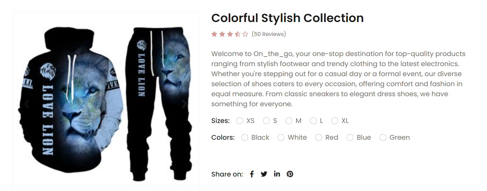

<h3> On_the_go ECOMMERCE PORTFOLIO PROJECT</h3>

<h1> On_the_go eCommerce Project </h1>

 Welcome to the On_the_go eCommerce Project! This platform provides a simple and efficient way to shop for various clothings and electronics online. Whether you're a customer looking to stock up on fashion products or household electronics, On_the_go offers a seamless shopping experience.

<h2> Features </h2>
<li><b>User Authentication: </b></li>Secure user registration and login functionality for customers.
<li><b>Product Listings: </b></li>Browse a wide range of products items categorized by type, brand, price range, and more.
<li><b>Product Details: </b></li>View detailed information about each product, including descriptions, prices, and images.
<li><b>Shopping Cart:</b></li> Add items to your cart and easily manage quantities before checkout.
<li><b>Checkout Process:</b></li> Secure payment gateway integration for hassle-free transactions.
<li><b>Delivery Tracking:</b></li> Track your order from purchase to delivery at your doorstep.

<h2> How It Works </h2>
<b>For Customers:</b>
<li>Sign Up/Login: </li>Create an account or log in to access all features.
<li>Browse Products: </li>Explore our extensive collection of items and filter by your preferences.
<li>Add to Cart: </li>Select your desired items and add them to your shopping cart.
<li>Proceed to Checkout:</li>Review your cart, enter delivery details, and choose your payment method.
<li>Complete Payment:</li> Confirm your order and securely complete the payment process.
<li>Track Orders: </li> (coming soon)

<h2> Technologies Used </h2>
<li><b>Frontend:</b></li> HTML, CSS, JavaScript, SCSS, Bootstrap
<li><b>Backend:</b></li> Python, Django Framework, SQLite3
<li><b>Authentication:</b></li> JSON Web Tokens (JWT) via Django REST Framework simple JWT
<li><b>Payment Integration:</b></li> Daraja API (Mpesa)
<li><b>Deployment:</b></li> Heroku

<h2> Getting Started </h2>
To run this project locally, follow these steps:

<li>Clone this repository.</li>
<li>Install dependencies using <code>pip install</code>.</li>
<li>Set up environment variables for your database connection, payment API keys, etc.</li>
<li>Run the development server using <code>py manage.py runserver</code>.</li>
<li>Access the application in your web browser at <a href="http://localhost:8000">http://localhost:8000</a>.</li>

<h2>Contributors</h2>
Morris Mwai (Morrismwai1997@gmail.com)

<h2> License </h2>
Aiden Softwares

<h2> Note </h2>
This project is still a work in progress. While many features are functional, there are ongoing developments and improvements being made. Feel free to contribute or provide feedback!
